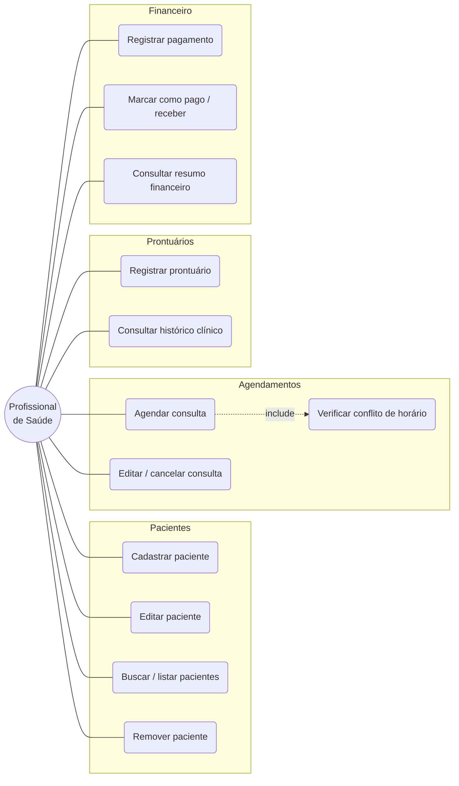

# Diagrama de Casos de Uso — ClinicFlow

Ator principal: **Profissional de Saúde** (usuário autônomo do consultório).

**Observação:** ao agendar uma consulta (UC5), o sistema executa a verificação de
conflito de horário (UC6) como passo incluído (relação «include»).
