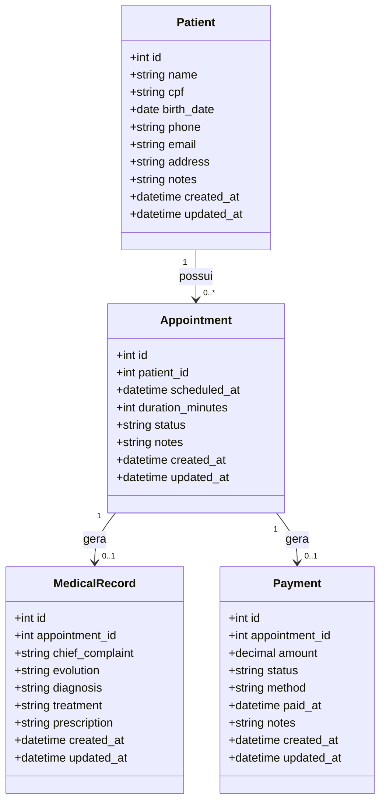

# Diagrama de Classes — ClinicFlow

**Status de `Appointment`:** `agendado` · `realizado` · `cancelado`
**Status de `Payment`:** `pendente` · `pago` · `cancelado`
**Forma de `Payment`:** `dinheiro` · `pix` · `cartao_debito` · `cartao_credito` · `transferencia`
