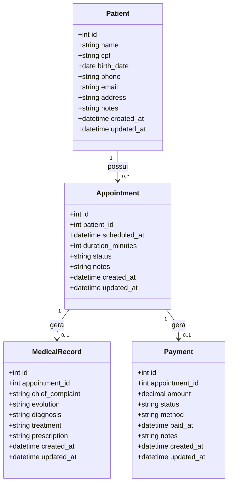
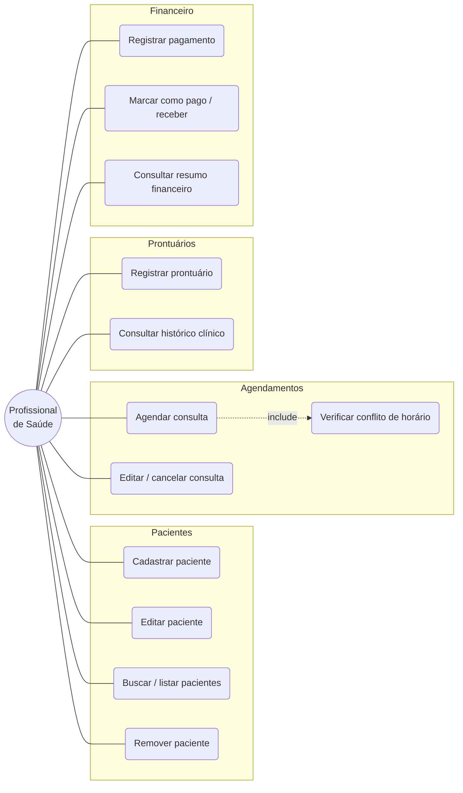

# Módulo Financeiro — Implementation Plan

> **For agentic workers:** REQUIRED SUB-SKILL: Use superpowers:subagent-driven-development (recommended) or superpowers:executing-plans to implement this plan task-by-task. Steps use checkbox (`- [ ]`) syntax for tracking.

**Goal:** Adicionar o módulo Financeiro ao ClinicFlow — registro de pagamento (1:1 por consulta) com painel de resumo — e produzir os diagramas (classes, casos de uso, MER) do projeto inteiro.

**Architecture:** Replica o padrão em camadas já usado nos módulos AC1/AC2/AC3 — `model` (SQLAlchemy) → `schema` (Pydantic) → `router` (FastAPI) no backend; página de lista + formulário (React + react-hook-form + axios) no frontend. Backend desenvolvido com TDD via FastAPI `TestClient` sobre SQLite em memória; frontend verificado com `npm run build` + checagem manual no app rodando.

**Tech Stack:** Python 3.11, FastAPI 0.111, SQLAlchemy 2.0, Pydantic 2.7, pytest + httpx (novo, só dev) · React 18, Vite, Tailwind, react-router-dom, react-hook-form, axios, dayjs, lucide-react · Mermaid (diagramas).

**Working dir:** `c:/Users/Thiag/Desktop/impacta/clinicflow` (repositório git). Todos os caminhos abaixo são relativos a essa raiz.

---

## Estrutura de arquivos

**Criar:**
- `backend/requirements-dev.txt` — dependências de teste
- `backend/tests/conftest.py` — fixture `client` (TestClient + SQLite em memória)
- `backend/tests/test_payments.py` — testes de integração do módulo
- `backend/app/models/payment.py` — entidade `Payment`
- `backend/app/schemas/payment.py` — schemas Pydantic
- `backend/app/routers/payments.py` — endpoints REST
- `frontend/src/pages/Financial.jsx` — lista + cards de resumo
- `frontend/src/pages/PaymentForm.jsx` — criar/editar pagamento
- `docs/diagrama-classes.md` · `docs/diagrama-casos-de-uso.md` · `docs/modelo-mer.md`

**Modificar:**
- `backend/app/models/__init__.py` · `backend/app/schemas/__init__.py` · `backend/app/routers/__init__.py` · `backend/app/main.py` — registrar o módulo
- `frontend/src/services/api.js` — funções da API
- `frontend/src/App.jsx` — rotas reais
- `frontend/src/components/Sidebar.jsx` — habilitar item Financeiro
- `frontend/src/pages/Appointments.jsx` — atalho de pagamento no card
- `README.md` — tabela de entregas + endpoints

---

## Task 1: Infraestrutura de testes do backend

**Files:**
- Create: `backend/requirements-dev.txt`
- Create: `backend/tests/conftest.py`
- Create: `backend/tests/test_smoke.py`

- [ ] **Step 1: Criar `backend/requirements-dev.txt`**

```text
pytest==8.2.0
httpx==0.27.0
```

- [ ] **Step 2: Criar `backend/tests/conftest.py`**

`os.environ["DATABASE_URL"] = "sqlite://"` é definido **antes** de importar `app.*`, para que o `create_all` no import de `app.main` rode em SQLite e nunca tente conectar no Postgres. As requisições do teste usam `override_get_db` ligado a um engine SQLite em memória com `StaticPool` (compartilha a mesma conexão entre threads).

```python
import os

os.environ["DATABASE_URL"] = "sqlite://"  # antes de importar app.* — evita conectar no Postgres

import pytest
from fastapi.testclient import TestClient
from sqlalchemy import create_engine
from sqlalchemy.orm import sessionmaker
from sqlalchemy.pool import StaticPool

from app.database import Base, get_db
import app.models  # noqa: F401 — registra todos os models
from app.main import app

test_engine = create_engine(
    "sqlite://",
    connect_args={"check_same_thread": False},
    poolclass=StaticPool,
)
TestingSessionLocal = sessionmaker(autocommit=False, autoflush=False, bind=test_engine)


def _override_get_db():
    db = TestingSessionLocal()
    try:
        yield db
    finally:
        db.close()


@pytest.fixture()
def client():
    Base.metadata.create_all(bind=test_engine)
    app.dependency_overrides[get_db] = _override_get_db
    with TestClient(app) as c:
        yield c
    app.dependency_overrides.clear()
    Base.metadata.drop_all(bind=test_engine)
```

- [ ] **Step 3: Criar `backend/tests/test_smoke.py`**

```python
def test_health(client):
    resp = client.get("/health")
    assert resp.status_code == 200
    assert resp.json() == {"status": "ok"}
```

- [ ] **Step 4: Instalar deps e rodar o teste**

Run (a partir de `backend/`):
```bash
python -m pip install -r requirements.txt -r requirements-dev.txt
python -m pytest tests/ -v
```
Expected: `test_smoke.py::test_health PASS` (1 passed).

- [ ] **Step 5: Commit**

```bash
git add backend/requirements-dev.txt backend/tests/conftest.py backend/tests/test_smoke.py
git commit -m "test: infra de testes do backend (pytest + TestClient + SQLite)"
```

---

## Task 2: Model `Payment`

**Files:**
- Create: `backend/app/models/payment.py`
- Modify: `backend/app/models/__init__.py`
- Test: `backend/tests/test_payments.py`

- [ ] **Step 1: Escrever o teste que falha**

Criar `backend/tests/test_payments.py`:

```python
def _create_appointment(client):
    """Cria um paciente + consulta e devolve o id da consulta."""
    p = client.post("/api/patients/", json={
        "name": "Maria Teste",
        "cpf": "39053344705",
        "birth_date": "1990-01-01",
        "phone": "11999998888",
    })
    assert p.status_code == 201, p.text
    patient_id = p.json()["id"]
    a = client.post("/api/appointments/", json={
        "patient_id": patient_id,
        "scheduled_at": "2026-06-01T10:00:00",
        "duration_minutes": 30,
    })
    assert a.status_code == 201, a.text
    return a.json()["id"]


def test_payment_model_importavel():
    from app.models.payment import Payment
    assert Payment.__tablename__ == "payments"
```

- [ ] **Step 2: Rodar para ver falhar**

Run: `cd backend && python -m pytest tests/test_payments.py::test_payment_model_importavel -v`
Expected: FAIL com `ModuleNotFoundError: No module named 'app.models.payment'`.

- [ ] **Step 3: Criar `backend/app/models/payment.py`**

```python
from sqlalchemy import Column, Integer, String, DateTime, Text, ForeignKey, Numeric
from sqlalchemy.orm import relationship, backref
from sqlalchemy.sql import func
from app.database import Base


class Payment(Base):
    __tablename__ = "payments"

    id = Column(Integer, primary_key=True, index=True)
    appointment_id = Column(
        Integer,
        ForeignKey("appointments.id", ondelete="CASCADE"),
        nullable=False,
        unique=True,
        index=True,
    )
    amount = Column(Numeric(10, 2), nullable=False)
    status = Column(String(20), nullable=False, default="pendente")
    method = Column(String(20), nullable=True)
    paid_at = Column(DateTime(timezone=False), nullable=True)
    notes = Column(Text, nullable=True)
    created_at = Column(DateTime(timezone=True), server_default=func.now())
    updated_at = Column(DateTime(timezone=True), onupdate=func.now())

    appointment = relationship(
        "Appointment",
        backref=backref("payment", uselist=False, cascade="all, delete-orphan"),
    )
```

- [ ] **Step 4: Registrar em `backend/app/models/__init__.py`**

Substituir o conteúdo por:

```python
from app.models.patient import Patient
from app.models.appointment import Appointment
from app.models.medical_record import MedicalRecord
from app.models.payment import Payment
```

- [ ] **Step 5: Rodar o teste**

Run: `cd backend && python -m pytest tests/test_payments.py::test_payment_model_importavel -v`
Expected: PASS.

- [ ] **Step 6: Commit**

```bash
git add backend/app/models/payment.py backend/app/models/__init__.py backend/tests/test_payments.py
git commit -m "feat: model Payment (1:1 com Appointment)"
```

---

## Task 3: Schemas `Payment`

**Files:**
- Create: `backend/app/schemas/payment.py`
- Modify: `backend/app/schemas/__init__.py`
- Test: `backend/tests/test_payments.py`

- [ ] **Step 1: Adicionar o teste que falha em `backend/tests/test_payments.py`** (acrescentar ao fim do arquivo)

```python
def test_payment_schema_rejeita_valor_zero():
    import pytest
    from pydantic import ValidationError
    from app.schemas.payment import PaymentCreate

    with pytest.raises(ValidationError):
        PaymentCreate(appointment_id=1, amount=0)

    ok = PaymentCreate(appointment_id=1, amount=150.0)
    assert ok.status == "pendente"
    assert ok.method is None
```

- [ ] **Step 2: Rodar para ver falhar**

Run: `cd backend && python -m pytest tests/test_payments.py::test_payment_schema_rejeita_valor_zero -v`
Expected: FAIL com `ModuleNotFoundError: No module named 'app.schemas.payment'`.

- [ ] **Step 3: Criar `backend/app/schemas/payment.py`**

```python
from pydantic import BaseModel, field_validator
from typing import Optional, Literal
from datetime import datetime


PaymentStatus = Literal["pendente", "pago", "cancelado"]
PaymentMethod = Literal["dinheiro", "pix", "cartao_debito", "cartao_credito", "transferencia"]


class PatientMini(BaseModel):
    id: int
    name: str
    cpf: str

    model_config = {"from_attributes": True}


class AppointmentMini(BaseModel):
    id: int
    scheduled_at: datetime
    status: str
    patient_id: int
    patient: Optional[PatientMini] = None

    model_config = {"from_attributes": True}


class PaymentBase(BaseModel):
    appointment_id: int
    amount: float
    status: PaymentStatus = "pendente"
    method: Optional[PaymentMethod] = None
    paid_at: Optional[datetime] = None
    notes: Optional[str] = None

    @field_validator("amount")
    @classmethod
    def validate_amount(cls, v):
        if v <= 0:
            raise ValueError("Valor deve ser maior que zero")
        return v


class PaymentCreate(PaymentBase):
    pass


class PaymentUpdate(BaseModel):
    amount: Optional[float] = None
    status: Optional[PaymentStatus] = None
    method: Optional[PaymentMethod] = None
    paid_at: Optional[datetime] = None
    notes: Optional[str] = None

    @field_validator("amount")
    @classmethod
    def validate_amount(cls, v):
        if v is not None and v <= 0:
            raise ValueError("Valor deve ser maior que zero")
        return v


class PaymentResponse(PaymentBase):
    id: int
    created_at: datetime
    updated_at: Optional[datetime] = None
    appointment: Optional[AppointmentMini] = None

    model_config = {"from_attributes": True}
```

- [ ] **Step 4: Registrar em `backend/app/schemas/__init__.py`** (acrescentar ao fim)

```python
from app.schemas.payment import (
    PaymentCreate,
    PaymentUpdate,
    PaymentResponse,
)
```

- [ ] **Step 5: Rodar o teste**

Run: `cd backend && python -m pytest tests/test_payments.py::test_payment_schema_rejeita_valor_zero -v`
Expected: PASS.

- [ ] **Step 6: Commit**

```bash
git add backend/app/schemas/payment.py backend/app/schemas/__init__.py backend/tests/test_payments.py
git commit -m "feat: schemas Pydantic do Payment"
```

---

## Task 4: Router — criar e ler pagamentos

**Files:**
- Create: `backend/app/routers/payments.py`
- Modify: `backend/app/routers/__init__.py`, `backend/app/main.py`
- Test: `backend/tests/test_payments.py`

- [ ] **Step 1: Adicionar testes que falham em `backend/tests/test_payments.py`** (acrescentar ao fim)

```python
def test_cria_pagamento_e_busca(client):
    appt_id = _create_appointment(client)
    resp = client.post("/api/payments/", json={
        "appointment_id": appt_id,
        "amount": 200.0,
        "method": "pix",
    })
    assert resp.status_code == 201, resp.text
    body = resp.json()
    assert body["amount"] == 200.0
    assert body["status"] == "pendente"
    assert body["appointment"]["patient"]["name"] == "Maria Teste"
    pid = body["id"]

    got = client.get(f"/api/payments/{pid}")
    assert got.status_code == 200
    assert got.json()["id"] == pid


def test_nao_permite_dois_pagamentos_na_mesma_consulta(client):
    appt_id = _create_appointment(client)
    first = client.post("/api/payments/", json={"appointment_id": appt_id, "amount": 100.0})
    assert first.status_code == 201
    dup = client.post("/api/payments/", json={"appointment_id": appt_id, "amount": 100.0})
    assert dup.status_code == 400


def test_pagamento_consulta_inexistente(client):
    resp = client.post("/api/payments/", json={"appointment_id": 9999, "amount": 50.0})
    assert resp.status_code == 400


def test_lista_filtra_por_status(client):
    appt_id = _create_appointment(client)
    client.post("/api/payments/", json={"appointment_id": appt_id, "amount": 80.0, "status": "pago"})
    pagos = client.get("/api/payments/", params={"status": "pago"})
    assert pagos.status_code == 200
    assert len(pagos.json()) == 1
    pendentes = client.get("/api/payments/", params={"status": "pendente"})
    assert pendentes.json() == []


def test_busca_por_consulta(client):
    appt_id = _create_appointment(client)
    client.post("/api/payments/", json={"appointment_id": appt_id, "amount": 90.0})
    resp = client.get(f"/api/payments/by-appointment/{appt_id}")
    assert resp.status_code == 200
    assert resp.json()["appointment_id"] == appt_id
```

- [ ] **Step 2: Rodar para ver falhar**

Run: `cd backend && python -m pytest tests/test_payments.py -v -k "cria or dois or inexistente or filtra or busca_por_consulta"`
Expected: FAIL (404 nas rotas `/api/payments/...` porque o router ainda não existe).

- [ ] **Step 3: Criar `backend/app/routers/payments.py`**

A rota `/summary` (Task 6) e `/by-appointment/{id}` são declaradas **antes** de `/{payment_id}` para não serem capturadas pela rota paramétrica. (A `/summary` entra na Task 6; aqui já deixamos `/by-appointment` antes de `/{payment_id}`.)

```python
from fastapi import APIRouter, Depends, HTTPException, Query
from sqlalchemy.orm import Session, joinedload
from typing import List, Optional
from datetime import datetime
from app.database import get_db
from app.models.payment import Payment
from app.models.appointment import Appointment
from app.schemas.payment import PaymentCreate, PaymentUpdate, PaymentResponse

router = APIRouter(prefix="/payments", tags=["Financeiro"])


def _payment_with_relations(db: Session, payment_id: int) -> Optional[Payment]:
    return (
        db.query(Payment)
        .options(joinedload(Payment.appointment).joinedload(Appointment.patient))
        .filter(Payment.id == payment_id)
        .first()
    )


@router.get("/", response_model=List[PaymentResponse])
def list_payments(
    status: Optional[str] = Query(None, description="Filtrar por status"),
    patient_id: Optional[int] = Query(None, description="Filtrar por paciente"),
    skip: int = 0,
    limit: int = 200,
    db: Session = Depends(get_db),
):
    query = (
        db.query(Payment)
        .join(Payment.appointment)
        .options(joinedload(Payment.appointment).joinedload(Appointment.patient))
    )
    if status:
        query = query.filter(Payment.status == status)
    if patient_id is not None:
        query = query.filter(Appointment.patient_id == patient_id)
    return (
        query.order_by(Appointment.scheduled_at.desc())
        .offset(skip)
        .limit(limit)
        .all()
    )


@router.get("/by-appointment/{appointment_id}", response_model=PaymentResponse)
def get_by_appointment(appointment_id: int, db: Session = Depends(get_db)):
    payment = (
        db.query(Payment)
        .options(joinedload(Payment.appointment).joinedload(Appointment.patient))
        .filter(Payment.appointment_id == appointment_id)
        .first()
    )
    if not payment:
        raise HTTPException(status_code=404, detail="Pagamento não encontrado para esta consulta")
    return payment


@router.get("/{payment_id}", response_model=PaymentResponse)
def get_payment(payment_id: int, db: Session = Depends(get_db)):
    payment = _payment_with_relations(db, payment_id)
    if not payment:
        raise HTTPException(status_code=404, detail="Pagamento não encontrado")
    return payment


@router.post("/", response_model=PaymentResponse, status_code=201)
def create_payment(payload: PaymentCreate, db: Session = Depends(get_db)):
    appointment = db.query(Appointment).filter(Appointment.id == payload.appointment_id).first()
    if not appointment:
        raise HTTPException(status_code=400, detail="Consulta não encontrada")

    existing = db.query(Payment).filter(Payment.appointment_id == payload.appointment_id).first()
    if existing:
        raise HTTPException(
            status_code=400,
            detail="Esta consulta já possui um pagamento (id: %d)" % existing.id,
        )

    data = payload.model_dump()
    if data.get("status") == "pago" and not data.get("paid_at"):
        data["paid_at"] = datetime.utcnow()

    payment = Payment(**data)
    db.add(payment)
    db.commit()
    db.refresh(payment)
    return _payment_with_relations(db, payment.id)
```

- [ ] **Step 4: Registrar em `backend/app/routers/__init__.py`** (acrescentar ao fim)

```python
from app.routers.payments import router as payments_router
```

- [ ] **Step 5: Incluir o router em `backend/app/main.py`**

Adicionar o import junto aos outros routers:
```python
from app.routers.payments import router as payments_router
```
E adicionar, logo após `app.include_router(medical_records_router, prefix="/api")`:
```python
app.include_router(payments_router, prefix="/api")
```

- [ ] **Step 6: Rodar os testes**

Run: `cd backend && python -m pytest tests/test_payments.py -v -k "cria or dois or inexistente or filtra or busca_por_consulta"`
Expected: PASS (5 passed).

- [ ] **Step 7: Commit**

```bash
git add backend/app/routers/payments.py backend/app/routers/__init__.py backend/app/main.py backend/tests/test_payments.py
git commit -m "feat: endpoints de criacao e leitura de pagamentos"
```

---

## Task 5: Router — atualizar (com `paid_at` automático) e remover

**Files:**
- Modify: `backend/app/routers/payments.py`
- Test: `backend/tests/test_payments.py`

- [ ] **Step 1: Adicionar testes que falham em `backend/tests/test_payments.py`** (acrescentar ao fim)

```python
def test_marcar_como_pago_seta_data_automaticamente(client):
    appt_id = _create_appointment(client)
    created = client.post("/api/payments/", json={"appointment_id": appt_id, "amount": 120.0})
    pid = created.json()["id"]
    assert created.json()["paid_at"] is None

    upd = client.put(f"/api/payments/{pid}", json={"status": "pago", "method": "dinheiro"})
    assert upd.status_code == 200, upd.text
    body = upd.json()
    assert body["status"] == "pago"
    assert body["paid_at"] is not None
    assert body["method"] == "dinheiro"


def test_remove_pagamento(client):
    appt_id = _create_appointment(client)
    pid = client.post("/api/payments/", json={"appointment_id": appt_id, "amount": 60.0}).json()["id"]
    assert client.delete(f"/api/payments/{pid}").status_code == 204
    assert client.get(f"/api/payments/{pid}").status_code == 404
```

- [ ] **Step 2: Rodar para ver falhar**

Run: `cd backend && python -m pytest tests/test_payments.py -v -k "pago or remove"`
Expected: FAIL (405 Method Not Allowed — PUT/DELETE ainda não existem).

- [ ] **Step 3: Adicionar os endpoints ao fim de `backend/app/routers/payments.py`**

```python
@router.put("/{payment_id}", response_model=PaymentResponse)
def update_payment(payment_id: int, payload: PaymentUpdate, db: Session = Depends(get_db)):
    payment = db.query(Payment).filter(Payment.id == payment_id).first()
    if not payment:
        raise HTTPException(status_code=404, detail="Pagamento não encontrado")

    for field, value in payload.model_dump(exclude_unset=True).items():
        setattr(payment, field, value)

    # Se virou "pago" e não há data registrada, marca agora
    if payment.status == "pago" and payment.paid_at is None:
        payment.paid_at = datetime.utcnow()

    db.commit()
    db.refresh(payment)
    return _payment_with_relations(db, payment.id)


@router.delete("/{payment_id}", status_code=204)
def delete_payment(payment_id: int, db: Session = Depends(get_db)):
    payment = db.query(Payment).filter(Payment.id == payment_id).first()
    if not payment:
        raise HTTPException(status_code=404, detail="Pagamento não encontrado")
    db.delete(payment)
    db.commit()
```

- [ ] **Step 4: Rodar os testes**

Run: `cd backend && python -m pytest tests/test_payments.py -v -k "pago or remove"`
Expected: PASS (2 passed).

- [ ] **Step 5: Commit**

```bash
git add backend/app/routers/payments.py backend/tests/test_payments.py
git commit -m "feat: atualizar (paid_at automatico) e remover pagamento"
```

---

## Task 6: Router — resumo financeiro (`/summary`)

**Files:**
- Modify: `backend/app/routers/payments.py`
- Test: `backend/tests/test_payments.py`

- [ ] **Step 1: Adicionar teste que falha em `backend/tests/test_payments.py`** (acrescentar ao fim)

```python
def test_resumo_financeiro(client):
    # 1 pago de 100, 1 pendente de 40 (em consultas distintas)
    a1 = _create_appointment(client)
    client.post("/api/payments/", json={"appointment_id": a1, "amount": 100.0, "status": "pago"})

    p2 = client.post("/api/patients/", json={
        "name": "Joao Teste", "cpf": "11144477735",
        "birth_date": "1985-05-05", "phone": "11988887777",
    }).json()
    a2 = client.post("/api/appointments/", json={
        "patient_id": p2["id"], "scheduled_at": "2026-06-02T11:00:00", "duration_minutes": 30,
    }).json()["id"]
    client.post("/api/payments/", json={"appointment_id": a2, "amount": 40.0, "status": "pendente"})

    resp = client.get("/api/payments/summary")
    assert resp.status_code == 200, resp.text
    s = resp.json()
    assert s["total_received"] == 100.0
    assert s["total_pending"] == 40.0
    assert s["count_paid"] == 1
    assert s["count_pending"] == 1
```

- [ ] **Step 2: Rodar para ver falhar**

Run: `cd backend && python -m pytest tests/test_payments.py::test_resumo_financeiro -v`
Expected: FAIL — a rota `/summary` cai em `get_payment` (`/{payment_id}`) e retorna 422/404.

- [ ] **Step 3: Inserir o endpoint `/summary` em `backend/app/routers/payments.py`**

Inserir **imediatamente antes** do endpoint `get_by_appointment` (ou seja, antes de qualquer rota `/{...}`), e atualizar os imports do topo do arquivo trocando a linha de import do `datetime`:

Troca:
```python
from datetime import datetime
```
por:
```python
from datetime import datetime, date, time
```

Endpoint a inserir antes de `get_by_appointment`:
```python
@router.get("/summary")
def payments_summary(
    start: Optional[date] = Query(None, description="Data inicial (paid_at)"),
    end: Optional[date] = Query(None, description="Data final (paid_at)"),
    db: Session = Depends(get_db),
):
    paid_query = db.query(Payment).filter(Payment.status == "pago")
    if start:
        paid_query = paid_query.filter(Payment.paid_at >= datetime.combine(start, time.min))
    if end:
        paid_query = paid_query.filter(Payment.paid_at <= datetime.combine(end, time.max))

    paid = paid_query.all()
    pending = db.query(Payment).filter(Payment.status == "pendente").all()

    total_received = sum(float(p.amount) for p in paid)
    total_pending = sum(float(p.amount) for p in pending)
    return {
        "total_received": round(total_received, 2),
        "total_pending": round(total_pending, 2),
        "count_paid": len(paid),
        "count_pending": len(pending),
    }
```

- [ ] **Step 4: Rodar o teste + suíte completa**

Run: `cd backend && python -m pytest tests/ -v`
Expected: PASS (todos — smoke + ~10 testes de pagamento).

- [ ] **Step 5: Commit**

```bash
git add backend/app/routers/payments.py backend/tests/test_payments.py
git commit -m "feat: endpoint de resumo financeiro (/payments/summary)"
```

---

## Task 7: Frontend — funções da API

**Files:**
- Modify: `frontend/src/services/api.js`

- [ ] **Step 1: Adicionar o bloco "Financeiro" ao fim de `frontend/src/services/api.js`**, logo antes de `export default api`:

```javascript
// ── Financeiro ─────────────────────────────────────────
export const getPayments = (filters = {}) =>
  api.get('/payments/', { params: filters })

export const getPayment = (id) =>
  api.get(`/payments/${id}`)

export const getPaymentByAppointment = (appointmentId) =>
  api.get(`/payments/by-appointment/${appointmentId}`)

export const getPaymentSummary = (filters = {}) =>
  api.get('/payments/summary', { params: filters })

export const createPayment = (data) =>
  api.post('/payments/', data)

export const updatePayment = (id, data) =>
  api.put(`/payments/${id}`, data)

export const deletePayment = (id) =>
  api.delete(`/payments/${id}`)
```

- [ ] **Step 2: Commit**

```bash
git add frontend/src/services/api.js
git commit -m "feat(front): funcoes de API do modulo Financeiro"
```

---

## Task 8: Frontend — página `Financial.jsx` (lista + resumo)

**Files:**
- Create: `frontend/src/pages/Financial.jsx`

- [ ] **Step 1: Criar `frontend/src/pages/Financial.jsx`**

```jsx
import { useState, useEffect, useCallback } from 'react'
import { Link } from 'react-router-dom'
import { Plus, Pencil, Trash2, DollarSign, User, Calendar, TrendingUp, Clock } from 'lucide-react'
import { getPayments, getPatients, deletePayment, getPaymentSummary } from '../services/api'
import toast from 'react-hot-toast'
import dayjs from 'dayjs'

const STATUS_STYLES = {
  pendente:  { label: 'Pendente',  cls: 'bg-yellow-100 text-yellow-700' },
  pago:      { label: 'Pago',      cls: 'bg-green-100 text-green-700' },
  cancelado: { label: 'Cancelado', cls: 'bg-gray-200 text-gray-600 line-through' },
}

const METHOD_LABEL = {
  dinheiro: 'Dinheiro',
  pix: 'PIX',
  cartao_debito: 'Cartão de débito',
  cartao_credito: 'Cartão de crédito',
  transferencia: 'Transferência',
}

const formatBRL = (v) =>
  Number(v || 0).toLocaleString('pt-BR', { style: 'currency', currency: 'BRL' })

export default function Financial() {
  const [payments, setPayments] = useState([])
  const [patients, setPatients] = useState([])
  const [summary, setSummary] = useState({ total_received: 0, total_pending: 0, count_paid: 0, count_pending: 0 })
  const [statusFilter, setStatusFilter] = useState('')
  const [patientFilter, setPatientFilter] = useState('')
  const [loading, setLoading] = useState(true)

  const fetchPayments = useCallback(async () => {
    try {
      setLoading(true)
      const params = {}
      if (statusFilter) params.status = statusFilter
      if (patientFilter) params.patient_id = Number(patientFilter)
      const { data } = await getPayments(params)
      setPayments(data)
    } catch {
      toast.error('Erro ao carregar pagamentos')
    } finally {
      setLoading(false)
    }
  }, [statusFilter, patientFilter])

  const fetchSummary = useCallback(async () => {
    try {
      const { data } = await getPaymentSummary()
      setSummary(data)
    } catch {
      /* resumo é informativo; ignora erro */
    }
  }, [])

  useEffect(() => {
    getPatients()
      .then(({ data }) => setPatients(data))
      .catch(() => toast.error('Erro ao carregar pacientes'))
  }, [])

  useEffect(() => { fetchPayments() }, [fetchPayments])
  useEffect(() => { fetchSummary() }, [fetchSummary])

  const handleDelete = async (payment) => {
    const patientName = payment.appointment?.patient?.name || 'paciente'
    if (!confirm(`Remover pagamento de ${patientName}?`)) return
    try {
      await deletePayment(payment.id)
      toast.success('Pagamento removido!')
      fetchPayments()
      fetchSummary()
    } catch {
      toast.error('Erro ao remover pagamento')
    }
  }

  return (
    <div className="flex-1 p-8">
      {/* Header */}
      <div className="flex items-center justify-between mb-8">
        <div>
          <h2 className="text-2xl font-bold text-gray-900">Financeiro</h2>
          <p className="text-sm text-gray-500 mt-1">
            {payments.length} pagamento{payments.length !== 1 ? 's' : ''}
          </p>
        </div>
        <Link
          to="/financial/new"
          className="flex items-center gap-2 bg-primary-600 hover:bg-primary-700 text-white px-4 py-2.5 rounded-lg text-sm font-medium transition-colors shadow-sm"
        >
          <Plus className="w-4 h-4" />
          Novo Pagamento
        </Link>
      </div>

      {/* Cards de resumo */}
      <div className="grid grid-cols-1 sm:grid-cols-2 lg:grid-cols-4 gap-4 mb-8">
        <SummaryCard icon={TrendingUp} color="text-green-600"   bg="bg-green-50"   label="Recebido"             value={formatBRL(summary.total_received)} />
        <SummaryCard icon={Clock}      color="text-yellow-600"  bg="bg-yellow-50"  label="Pendente"             value={formatBRL(summary.total_pending)} />
        <SummaryCard icon={DollarSign} color="text-primary-600" bg="bg-primary-50" label="Consultas pagas"      value={summary.count_paid} />
        <SummaryCard icon={DollarSign} color="text-gray-500"    bg="bg-gray-100"   label="Consultas pendentes"  value={summary.count_pending} />
      </div>

      {/* Filtros */}
      <div className="flex items-center gap-3 mb-6 flex-wrap">
        <select
          value={statusFilter}
          onChange={(e) => setStatusFilter(e.target.value)}
          className="px-3 py-2.5 text-sm border border-gray-200 rounded-lg bg-white focus:outline-none focus:ring-2 focus:ring-primary-500"
        >
          <option value="">Todos os status</option>
          <option value="pendente">Pendente</option>
          <option value="pago">Pago</option>
          <option value="cancelado">Cancelado</option>
        </select>
        <div className="relative">
          <User className="absolute left-3 top-1/2 -translate-y-1/2 w-4 h-4 text-gray-400 pointer-events-none" />
          <select
            value={patientFilter}
            onChange={(e) => setPatientFilter(e.target.value)}
            className="pl-10 pr-3 py-2.5 text-sm border border-gray-200 rounded-lg bg-white focus:outline-none focus:ring-2 focus:ring-primary-500 min-w-[240px]"
          >
            <option value="">Todos os pacientes</option>
            {patients.map((p) => (
              <option key={p.id} value={p.id}>{p.name}</option>
            ))}
          </select>
        </div>
        {(statusFilter || patientFilter) && (
          <button
            onClick={() => { setStatusFilter(''); setPatientFilter('') }}
            className="px-3 py-2.5 text-sm font-medium text-gray-600 bg-white border border-gray-200 rounded-lg hover:bg-gray-50 transition-colors"
          >
            Limpar filtros
          </button>
        )}
      </div>

      {/* Lista */}
      {loading ? (
        <div className="flex items-center justify-center py-20 text-gray-400">
          <div className="animate-spin w-6 h-6 border-2 border-primary-500 border-t-transparent rounded-full mr-3" />
          Carregando...
        </div>
      ) : payments.length === 0 ? (
        <div className="text-center py-20 text-gray-400">
          <DollarSign className="w-12 h-12 mx-auto mb-3 opacity-30" />
          <p className="font-medium">Nenhum pagamento encontrado</p>
          <p className="text-sm mt-1">Clique em "Novo Pagamento" para registrar</p>
        </div>
      ) : (
        <div className="space-y-3">
          {payments.map((p) => {
            const appt = p.appointment
            const patient = appt?.patient
            const date = appt?.scheduled_at ? dayjs(appt.scheduled_at) : null
            const status = STATUS_STYLES[p.status] ?? STATUS_STYLES.pendente
            return (
              <div
                key={p.id}
                className="bg-white rounded-xl border border-gray-200 p-5 shadow-sm hover:shadow-md transition-shadow"
              >
                <div className="flex items-center gap-5">
                  {/* Valor + status */}
                  <div className="flex flex-col items-center justify-center w-28 flex-shrink-0 border-r border-gray-100 pr-5">
                    <span className="font-bold text-gray-900 text-lg">{formatBRL(p.amount)}</span>
                    <span className={`mt-1 text-xs px-2 py-0.5 rounded-full font-medium ${status.cls}`}>
                      {status.label}
                    </span>
                  </div>

                  {/* Conteúdo */}
                  <div className="flex-1 min-w-0">
                    <div className="flex items-center gap-2 mb-1">
                      <User className="w-4 h-4 text-gray-400 flex-shrink-0" />
                      <span className="font-medium text-gray-900 truncate">
                        {patient?.name ?? 'Paciente desconhecido'}
                      </span>
                    </div>
                    <div className="flex items-center gap-3 text-xs text-gray-500 flex-wrap">
                      <span className="flex items-center gap-1">
                        <Calendar className="w-3.5 h-3.5" />
                        {date ? date.format('DD/MM/YYYY HH:mm') : '—'}
                      </span>
                      {p.method && <span>• {METHOD_LABEL[p.method] ?? p.method}</span>}
                      {p.paid_at && <span>• pago em {dayjs(p.paid_at).format('DD/MM/YYYY')}</span>}
                    </div>
                    {p.notes && <p className="text-sm text-gray-600 mt-2 line-clamp-2">{p.notes}</p>}
                  </div>

                  {/* Ações */}
                  <div className="flex items-center gap-1 flex-shrink-0">
                    <Link
                      to={`/financial/${p.id}/edit`}
                      className="p-2 rounded-lg hover:bg-blue-50 text-gray-400 hover:text-blue-600 transition-colors"
                      title="Editar"
                    >
                      <Pencil className="w-4 h-4" />
                    </Link>
                    <button
                      onClick={() => handleDelete(p)}
                      className="p-2 rounded-lg hover:bg-red-50 text-gray-400 hover:text-red-600 transition-colors"
                      title="Remover"
                    >
                      <Trash2 className="w-4 h-4" />
                    </button>
                  </div>
                </div>
              </div>
            )
          })}
        </div>
      )}
    </div>
  )
}

function SummaryCard({ icon: Icon, color, bg, label, value }) {
  return (
    <div className="bg-white rounded-xl border border-gray-200 p-4 shadow-sm flex items-center gap-3">
      <div className={`w-10 h-10 rounded-lg ${bg} flex items-center justify-center flex-shrink-0`}>
        <Icon className={`w-5 h-5 ${color}`} />
      </div>
      <div className="min-w-0">
        <p className="text-xs text-gray-500">{label}</p>
        <p className="font-bold text-gray-900 truncate">{value}</p>
      </div>
    </div>
  )
}
```

- [ ] **Step 2: Commit**

```bash
git add frontend/src/pages/Financial.jsx
git commit -m "feat(front): pagina Financeiro (lista + cards de resumo)"
```

---

## Task 9: Frontend — formulário `PaymentForm.jsx`

**Files:**
- Create: `frontend/src/pages/PaymentForm.jsx`

- [ ] **Step 1: Criar `frontend/src/pages/PaymentForm.jsx`**

```jsx
import { useEffect, useState } from 'react'
import { useNavigate, useParams, Link, useSearchParams } from 'react-router-dom'
import { useForm } from 'react-hook-form'
import { ArrowLeft, Save } from 'lucide-react'
import {
  createPayment,
  updatePayment,
  getPayment,
  getAppointments,
  getAppointment,
} from '../services/api'
import toast from 'react-hot-toast'
import dayjs from 'dayjs'

const Field = ({ label, error, children }) => (
  <div>
    <label className="block text-sm font-medium text-gray-700 mb-1">{label}</label>
    {children}
    {error && <p className="mt-1 text-xs text-red-500">{error}</p>}
  </div>
)

const inputCls = (error) =>
  `w-full px-3 py-2.5 rounded-lg border text-sm focus:outline-none focus:ring-2 focus:ring-primary-500 focus:border-transparent transition ${
    error ? 'border-red-400 bg-red-50' : 'border-gray-200 bg-white'
  }`

export default function PaymentForm() {
  const { id } = useParams()
  const navigate = useNavigate()
  const [searchParams] = useSearchParams()
  const isEdit = Boolean(id)
  const presetAppointmentId = searchParams.get('appointment_id')

  const [appointments, setAppointments] = useState([])
  const [lockedAppointment, setLockedAppointment] = useState(null)

  const {
    register,
    handleSubmit,
    reset,
    watch,
    formState: { errors, isSubmitting },
  } = useForm({
    defaultValues: {
      appointment_id: '',
      amount: '',
      status: 'pendente',
      method: '',
      paid_at: '',
      notes: '',
    },
  })

  const statusValue = watch('status')

  // Lista de consultas (só ao criar sem consulta pré-fixada)
  useEffect(() => {
    if (isEdit || presetAppointmentId) return
    getAppointments()
      .then(({ data }) => setAppointments(data))
      .catch(() => toast.error('Erro ao carregar consultas'))
  }, [isEdit, presetAppointmentId])

  // Consulta pré-fixada via query string
  useEffect(() => {
    if (isEdit || !presetAppointmentId) return
    getAppointment(presetAppointmentId)
      .then(({ data }) => {
        setLockedAppointment(data)
        reset((prev) => ({ ...prev, appointment_id: data.id }))
      })
      .catch(() => toast.error('Erro ao carregar consulta'))
  }, [isEdit, presetAppointmentId, reset])

  // Edição: carregar pagamento existente
  useEffect(() => {
    if (!isEdit) return
    getPayment(id)
      .then(({ data }) => {
        setLockedAppointment(data.appointment ?? null)
        reset({
          appointment_id: data.appointment_id,
          amount: data.amount ?? '',
          status: data.status ?? 'pendente',
          method: data.method ?? '',
          paid_at: data.paid_at ? dayjs(data.paid_at).format('YYYY-MM-DDTHH:mm') : '',
          notes: data.notes ?? '',
        })
      })
      .catch(() => toast.error('Erro ao carregar pagamento'))
  }, [id, isEdit, reset])

  const onSubmit = async (data) => {
    const payload = {
      appointment_id: Number(data.appointment_id),
      amount: Number(data.amount),
      status: data.status,
      method: data.method || null,
      paid_at: data.paid_at ? new Date(data.paid_at).toISOString() : null,
      notes: data.notes || null,
    }

    try {
      if (isEdit) {
        const { appointment_id, ...updatePayload } = payload
        await updatePayment(id, updatePayload)
        toast.success('Pagamento atualizado!')
      } else {
        await createPayment(payload)
        toast.success('Pagamento registrado!')
      }
      navigate('/financial')
    } catch (err) {
      const detail = err.response?.data?.detail
      toast.error(typeof detail === 'string' ? detail : 'Erro ao salvar pagamento')
    }
  }

  const formatAppointment = (a) => {
    const when = dayjs(a.scheduled_at).format('DD/MM/YYYY HH:mm')
    const patient = a.patient?.name ?? `Paciente #${a.patient_id}`
    return `${when} — ${patient}`
  }

  const appointmentLocked = isEdit || Boolean(presetAppointmentId)

  return (
    <div className="flex-1 p-8 max-w-3xl">
      {/* Header */}
      <div className="flex items-center gap-4 mb-8">
        <Link to="/financial" className="p-2 rounded-lg hover:bg-gray-100 text-gray-500 transition-colors">
          <ArrowLeft className="w-5 h-5" />
        </Link>
        <div>
          <h2 className="text-2xl font-bold text-gray-900">
            {isEdit ? 'Editar Pagamento' : 'Novo Pagamento'}
          </h2>
          <p className="text-sm text-gray-500 mt-0.5">
            {isEdit ? 'Atualize os dados do pagamento' : 'Registre o pagamento de uma consulta'}
          </p>
        </div>
      </div>

      <form onSubmit={handleSubmit(onSubmit)} className="bg-white rounded-xl border border-gray-200 p-6 shadow-sm space-y-5">
        {/* Consulta */}
        <Field label="Consulta *" error={errors.appointment_id?.message}>
          {appointmentLocked && lockedAppointment ? (
            <div className="px-3 py-2.5 rounded-lg border border-gray-200 bg-gray-50 text-sm text-gray-700">
              {formatAppointment(lockedAppointment)}
            </div>
          ) : (
            <select
              className={inputCls(errors.appointment_id)}
              {...register('appointment_id', { required: 'Selecione uma consulta' })}
            >
              <option value="">Selecione uma consulta...</option>
              {appointments.map((a) => (
                <option key={a.id} value={a.id}>{formatAppointment(a)}</option>
              ))}
            </select>
          )}
        </Field>

        {/* Valor */}
        <Field label="Valor (R$) *" error={errors.amount?.message}>
          <input
            type="number"
            step="0.01"
            min="0.01"
            placeholder="0,00"
            className={inputCls(errors.amount)}
            {...register('amount', {
              required: 'Valor obrigatório',
              validate: (v) => Number(v) > 0 || 'Valor deve ser maior que zero',
            })}
          />
        </Field>

        {/* Status + Forma */}
        <div className="grid grid-cols-1 sm:grid-cols-2 gap-5">
          <Field label="Status" error={errors.status?.message}>
            <select className={inputCls(errors.status)} {...register('status')}>
              <option value="pendente">Pendente</option>
              <option value="pago">Pago</option>
              <option value="cancelado">Cancelado</option>
            </select>
          </Field>

          <Field label="Forma de pagamento" error={errors.method?.message}>
            <select className={inputCls(errors.method)} {...register('method')}>
              <option value="">—</option>
              <option value="dinheiro">Dinheiro</option>
              <option value="pix">PIX</option>
              <option value="cartao_debito">Cartão de débito</option>
              <option value="cartao_credito">Cartão de crédito</option>
              <option value="transferencia">Transferência</option>
            </select>
          </Field>
        </div>

        {/* Data do pagamento */}
        <Field label="Data do pagamento" error={errors.paid_at?.message}>
          <input
            type="datetime-local"
            className={inputCls(errors.paid_at)}
            {...register('paid_at')}
          />
          {statusValue === 'pago' && (
            <p className="mt-1 text-xs text-gray-400">
              Se deixar em branco, a data atual será registrada ao salvar.
            </p>
          )}
        </Field>

        {/* Observações */}
        <Field label="Observações" error={errors.notes?.message}>
          <textarea
            rows={3}
            placeholder="Detalhes do pagamento (opcional)"
            className={`${inputCls(errors.notes)} resize-none`}
            {...register('notes')}
          />
        </Field>

        {/* Ações */}
        <div className="flex items-center justify-end gap-3 pt-2 border-t border-gray-100">
          <Link
            to="/financial"
            className="px-4 py-2 rounded-lg text-sm font-medium text-gray-600 hover:bg-gray-100 transition-colors"
          >
            Cancelar
          </Link>
          <button
            type="submit"
            disabled={isSubmitting}
            className="flex items-center gap-2 bg-primary-600 hover:bg-primary-700 text-white px-5 py-2 rounded-lg text-sm font-medium transition-colors disabled:opacity-60"
          >
            <Save className="w-4 h-4" />
            {isSubmitting ? 'Salvando...' : 'Salvar Pagamento'}
          </button>
        </div>
      </form>
    </div>
  )
}
```

- [ ] **Step 2: Commit**

```bash
git add frontend/src/pages/PaymentForm.jsx
git commit -m "feat(front): formulario de pagamento (criar/editar)"
```

---

## Task 10: Frontend — rotas, sidebar e atalho no agendamento

**Files:**
- Modify: `frontend/src/App.jsx`
- Modify: `frontend/src/components/Sidebar.jsx`
- Modify: `frontend/src/pages/Appointments.jsx`

- [ ] **Step 1: Atualizar `frontend/src/App.jsx`**

Substituir o conteúdo inteiro por (importa as páginas novas, troca o `ComingSoon` por rotas reais — o componente `ComingSoon` deixa de ser usado e é removido):

```jsx
import { BrowserRouter, Routes, Route, Navigate } from 'react-router-dom'
import { Toaster } from 'react-hot-toast'
import Sidebar from './components/Sidebar'
import Patients from './pages/Patients'
import PatientForm from './pages/PatientForm'
import Appointments from './pages/Appointments'
import AppointmentForm from './pages/AppointmentForm'
import Records from './pages/Records'
import RecordForm from './pages/RecordForm'
import Financial from './pages/Financial'
import PaymentForm from './pages/PaymentForm'

export default function App() {
  return (
    <BrowserRouter>
      <Toaster position="top-right" toastOptions={{ duration: 3000 }} />
      <div className="flex min-h-screen">
        <Sidebar />
        <main className="flex-1 flex flex-col">
          <Routes>
            <Route path="/" element={<Navigate to="/patients" replace />} />
            <Route path="/patients" element={<Patients />} />
            <Route path="/patients/new" element={<PatientForm />} />
            <Route path="/patients/:id/edit" element={<PatientForm />} />
            <Route path="/appointments" element={<Appointments />} />
            <Route path="/appointments/new" element={<AppointmentForm />} />
            <Route path="/appointments/:id/edit" element={<AppointmentForm />} />
            <Route path="/records" element={<Records />} />
            <Route path="/records/new" element={<RecordForm />} />
            <Route path="/records/:id/edit" element={<RecordForm />} />
            <Route path="/financial" element={<Financial />} />
            <Route path="/financial/new" element={<PaymentForm />} />
            <Route path="/financial/:id/edit" element={<PaymentForm />} />
          </Routes>
        </main>
      </div>
    </BrowserRouter>
  )
}
```

- [ ] **Step 2: Atualizar `frontend/src/components/Sidebar.jsx`**

No array `navItems`, trocar a linha do Financeiro (remover `soon: true`):
```javascript
  { to: '/financial', icon: DollarSign, label: 'Financeiro' },
```
E no rodapé, trocar o rótulo da versão:
```jsx
        <p className="text-xs text-gray-400 text-center">ClinicFlow v2.0 — Prova</p>
```

- [ ] **Step 3: Adicionar atalho de pagamento em `frontend/src/pages/Appointments.jsx`**

Na linha de import dos ícones, acrescentar `DollarSign`:
```javascript
import { Plus, Pencil, Trash2, Calendar, Clock, User, ChevronLeft, ChevronRight, FileText, DollarSign } from 'lucide-react'
```
No bloco de ações de cada card (dentro de `<div className="flex items-center gap-1 flex-shrink-0">`), adicionar **antes** do link de prontuário (`FileText`):
```jsx
                  <Link
                    to={`/financial/new?appointment_id=${a.id}`}
                    className="p-2 rounded-lg hover:bg-emerald-50 text-gray-400 hover:text-emerald-600 transition-colors"
                    title="Pagamento"
                  >
                    <DollarSign className="w-4 h-4" />
                  </Link>
```

- [ ] **Step 4: Instalar deps e validar o build**

Run (a partir de `frontend/`):
```bash
npm install
npm run build
```
Expected: build conclui sem erros (sem "Could not resolve import", sem erro de sintaxe). Saída termina com `✓ built in ...`.

- [ ] **Step 5: Commit**

```bash
git add frontend/src/App.jsx frontend/src/components/Sidebar.jsx frontend/src/pages/Appointments.jsx
git commit -m "feat(front): rotas do Financeiro, sidebar e atalho no agendamento"
```

---

## Task 11: Diagrama de classes (projeto inteiro)

**Files:**
- Create: `docs/diagrama-classes.md`

- [ ] **Step 1: Criar `docs/diagrama-classes.md`**

````markdown
# Diagrama de Classes — ClinicFlow



**Status de `Appointment`:** `agendado` · `realizado` · `cancelado`
**Status de `Payment`:** `pendente` · `pago` · `cancelado`
**Forma de `Payment`:** `dinheiro` · `pix` · `cartao_debito` · `cartao_credito` · `transferencia`
````

- [ ] **Step 2: Verificar renderização**

Abrir o arquivo no preview de Markdown do VS Code (ou colar o bloco em https://mermaid.live) e confirmar que o diagrama renderiza com as 4 classes e as 3 relações.
Expected: 4 classes visíveis, relações 1→0..\* e 1→0..1.

- [ ] **Step 3: Commit**

```bash
git add docs/diagrama-classes.md
git commit -m "docs: diagrama de classes do projeto"
```

---

## Task 12: Diagrama de casos de uso (projeto inteiro)

**Files:**
- Create: `docs/diagrama-casos-de-uso.md`

- [ ] **Step 1: Criar `docs/diagrama-casos-de-uso.md`**

````markdown
# Diagrama de Casos de Uso — ClinicFlow

Ator principal: **Profissional de Saúde** (usuário autônomo do consultório).



**Observação:** ao agendar uma consulta (UC5), o sistema executa a verificação de
conflito de horário (UC6) como passo incluído (relação «include»).
````

- [ ] **Step 2: Verificar renderização**

Abrir no preview de Markdown / mermaid.live.
Expected: o ator conectado a todos os casos de uso, agrupados nos 4 módulos, com a seta «include» de UC5 para UC6.

- [ ] **Step 3: Commit**

```bash
git add docs/diagrama-casos-de-uso.md
git commit -m "docs: diagrama de casos de uso do projeto"
```

---

## Task 13: Modelo MER (projeto inteiro)

**Files:**
- Create: `docs/modelo-mer.md`

- [ ] **Step 1: Criar `docs/modelo-mer.md`**

````markdown
# Modelo Entidade-Relacionamento (MER) — ClinicFlow

Banco: PostgreSQL 16.

```mermaid
erDiagram
    PATIENTS ||--o{ APPOINTMENTS : "possui"
    APPOINTMENTS ||--o| MEDICAL_RECORDS : "gera"
    APPOINTMENTS ||--o| PAYMENTS : "gera"

    PATIENTS {
        int id PK
        varchar name
        varchar cpf UK
        date birth_date
        varchar phone
        varchar email
        varchar address
        text notes
        timestamp created_at
        timestamp updated_at
    }
    APPOINTMENTS {
        int id PK
        int patient_id FK
        timestamp scheduled_at
        int duration_minutes
        varchar status
        text notes
        timestamp created_at
        timestamp updated_at
    }
    MEDICAL_RECORDS {
        int id PK
        int appointment_id FK_UK
        text chief_complaint
        text evolution
        varchar diagnosis
        text treatment
        text prescription
        timestamp created_at
        timestamp updated_at
    }
    PAYMENTS {
        int id PK
        int appointment_id FK_UK
        numeric amount
        varchar status
        varchar method
        timestamp paid_at
        text notes
        timestamp created_at
        timestamp updated_at
    }
```

**Cardinalidades:**
- Um **paciente** tem zero ou muitos **agendamentos** (1:N).
- Um **agendamento** tem zero ou um **prontuário** (1:1 — `appointment_id` único).
- Um **agendamento** tem zero ou um **pagamento** (1:1 — `appointment_id` único).

**Legenda:** PK = chave primária · FK = chave estrangeira · UK = única ·
FK_UK = chave estrangeira com restrição de unicidade (garante o vínculo 1:1).
````

- [ ] **Step 2: Verificar renderização**

Abrir no preview de Markdown / mermaid.live.
Expected: 4 entidades com colunas; relações `||--o{` (1:N) e `||--o|` (1:1).

- [ ] **Step 3: Commit**

```bash
git add docs/modelo-mer.md
git commit -m "docs: modelo MER do banco"
```

---

## Task 14: Atualizar README

**Files:**
- Modify: `README.md`

- [ ] **Step 1: Atualizar a tabela de Entregas em `README.md`**

Trocar a linha:
```markdown
| Prova   | Financeiro / Pagamentos     | 🚧 Em breve |
```
por:
```markdown
| Prova   | Financeiro / Pagamentos     | ✅ Pronto |
```

- [ ] **Step 2: Adicionar a seção de endpoints do Financeiro ao fim de `README.md`**

```markdown
### Prova — Financeiro

| Método | Rota                                   | Descrição                                   |
|--------|----------------------------------------|---------------------------------------------|
| GET    | /api/payments/                         | Listar pagamentos (filtros `?status=`, `?patient_id=`) |
| GET    | /api/payments/summary                  | Resumo: recebido, pendente e contagens (`?start=`, `?end=`) |
| GET    | /api/payments/{id}                     | Buscar pagamento por ID                     |
| GET    | /api/payments/by-appointment/{id}      | Buscar pagamento pela consulta              |
| POST   | /api/payments/                         | Criar pagamento (1 por consulta)            |
| PUT    | /api/payments/{id}                     | Atualizar pagamento                         |
| DELETE | /api/payments/{id}                     | Remover pagamento                           |

**Modelo:** cada pagamento é vinculado a uma consulta (relação 1:1). Campos:
`amount` (valor > 0), `status` (`pendente`/`pago`/`cancelado`), `method`
(forma de pagamento), `paid_at` (preenchido automaticamente ao marcar como
`pago`, se não informado) e `notes`.

**Diagramas:** ver `docs/diagrama-classes.md`, `docs/diagrama-casos-de-uso.md`
e `docs/modelo-mer.md`.
```

- [ ] **Step 3: Commit**

```bash
git add README.md
git commit -m "docs: atualiza README com modulo Financeiro"
```

---

## Verificação final (após todas as tasks)

- [ ] **Backend — suíte completa**

Run: `cd backend && python -m pytest tests/ -v`
Expected: todos os testes passam.

- [ ] **App ponta a ponta via Docker**

Run (na raiz): `docker-compose up --build`
Verificar manualmente:
1. Frontend em http://localhost:5174 — item "Financeiro" aparece **sem** "Em breve".
2. Criar paciente → criar consulta → na consulta, clicar no ícone `$` → registrar pagamento.
3. Em "Financeiro": pagamento aparece na lista; cards de resumo mostram o valor pendente.
4. Editar o pagamento → status "pago" → resumo move o valor de Pendente para Recebido e preenche a data.
5. Tentar criar 2º pagamento para a mesma consulta → erro tratado (toast).
6. API docs em http://localhost:8001/docs — tag "Financeiro" com os 7 endpoints.

- [ ] **Diagramas renderizam** (preview de Markdown nos 3 arquivos em `docs/`).

---

## Cobertura do spec (self-review)

- Pagamento por consulta 1:1, criação manual → Tasks 2, 4.
- Campos (valor, status, método, paid_at, notes) → Tasks 2, 3.
- Validação valor > 0 → Task 3.
- Não duplicar pagamento por consulta → Task 4.
- `paid_at` automático ao marcar pago → Task 5 (e na criação, Task 4).
- Endpoints CRUD + by-appointment + summary → Tasks 4, 5, 6.
- Frontend lista + resumo + form + integração → Tasks 7-10.
- Sidebar habilitada, rota real, atalho na consulta → Task 10.
- Diagramas (classes, casos de uso, MER) do projeto inteiro → Tasks 11-13.
- README atualizado → Task 14.
